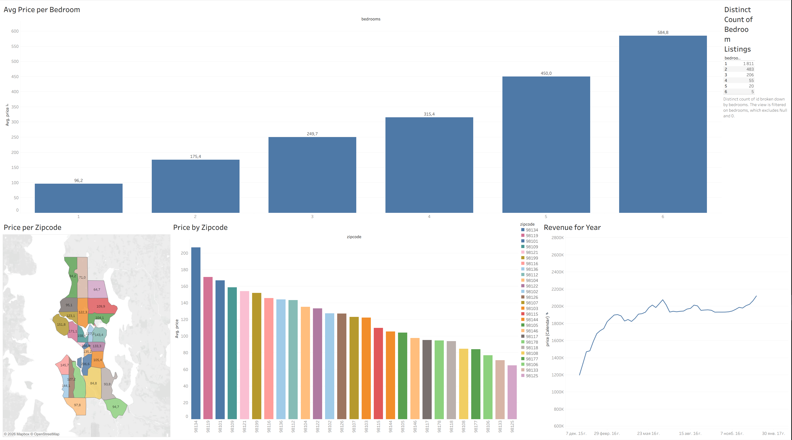

## About the Project
In this project, I analyzed Airbnb listing data using Tableau and built an interactive dashboard to explore market trends, pricing, and listing activity.

The main goal was to better understand how different factors such as location, availability, and reviews affect Airbnb listings and pricing.

---

## What the Project Includes
- data exploration in Tableau
- data preparation and organization
- interactive visualizations
- dashboard creation
- trend and pricing analysis

---

## Dataset
The dataset contains Airbnb listing information, including:
- prices
- locations
- availability
- reviews
- listing characteristics

---

## Dashboard Features
The dashboard allows users to:
- explore Airbnb prices by location
- analyze listing availability
- compare different market trends
- interact with filters and visual elements
- identify patterns in Airbnb activity

---

## Tools Used
- Tableau
- Data Visualization
- Dashboard Design
- Data Analysis

---

## Project Files

```text
tableau-airbnb-analysis/
│
├── README.md
├── tableau/
│   └── Airbnb_project_Tableau.twb
└── images/
    └── dashboard_preview.png
```

---

## Dashboard Preview





---

## Tableau Public
https://public.tableau.com/views/Airbnb_project_Tableau/Dashboard1?:language=en-US&:sid=&:redirect=auth&:display_count=n&:origin=viz_share_link